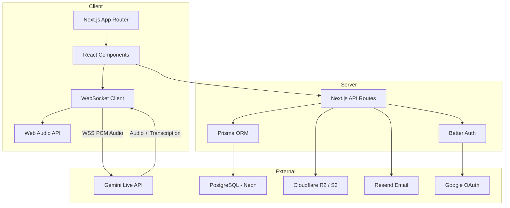
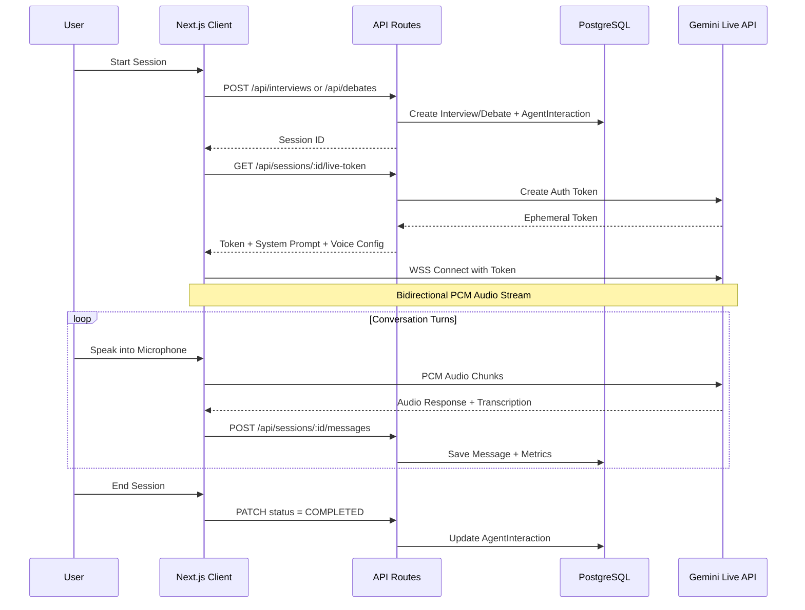
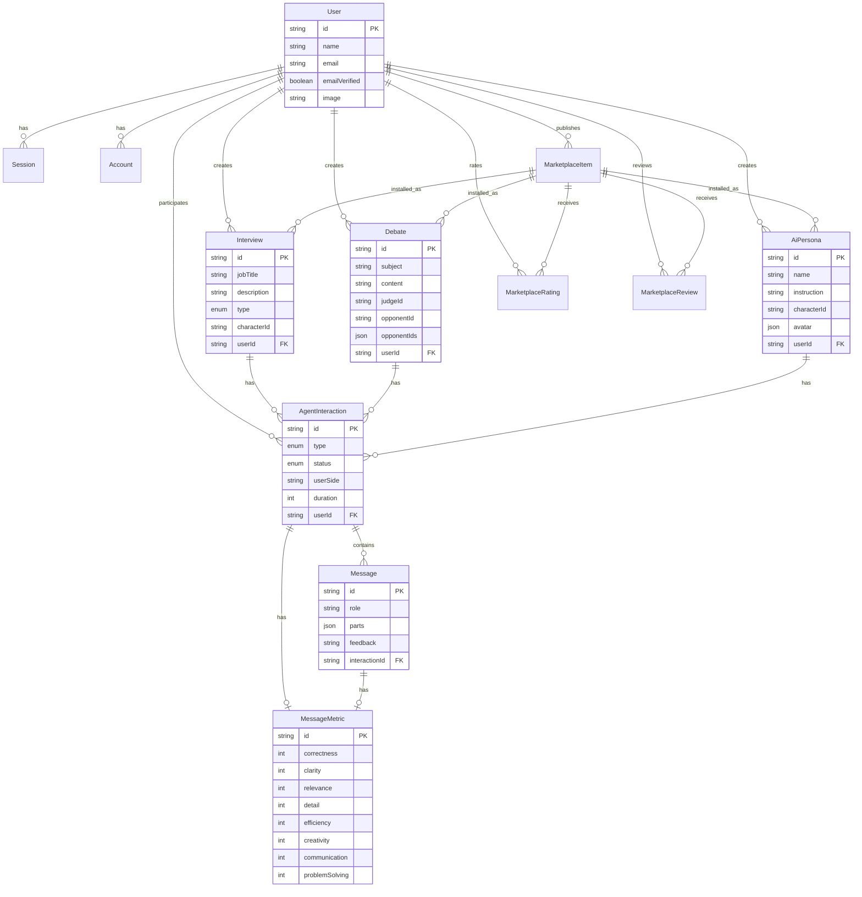

<div align="center">
  
  <h1>Amplify: Own Your Voice</h1>
  <p><strong>An AI-augmented communication laboratory powered by Google Gemini Multimodal Live API</strong></p>

  <p>
    <a href="#-key-modules">Modules</a> •
    <a href="#-features">Features</a> •
    <a href="#-architecture">Architecture</a> •
    <a href="#-getting-started">Getting Started</a> •
    <a href="#-contributing">Contributing</a>
  </p>
</div>

---

**Amplify** is a real-time, voice-first communication training platform that transforms how individuals express their ideas. From high-pressure executive interviews to the intellectual rigor of structured parliamentary debates, Amplify provides a sophisticated sandbox for cognitive and verbal mastery.

Built on the **Google Gemini Multimodal Live API** over WebSockets, every interaction is a live, bidirectional voice conversation — not a chatbot. You speak, the AI listens, responds with its own voice, and evaluates your performance in real time.


## 🌟 Key Modules

### 🎤 AI Interviews

Practice with industry-specific AI interviewers for both **Technical** and **General** interview types. Choose from 30 unique AI characters, each with distinct voices and personalities. Receive real-time voice feedback, turn-by-turn scoring across 8 metrics (correctness, clarity, relevance, detail, efficiency, creativity, communication, problem-solving), and a detailed post-session verdict.

### ⚔️ Debate Arena

Engage in structured **British Parliamentary-style debates** with a 13-turn format featuring multiple AI characters: a judge, lead opponent, deputy, and whip. Choose your side (PRO/CON) on any motion, then argue your case across six formal rounds — Prime Minister, Leader of Opposition, Deputy speeches, Rebuttals, and a Closing Judgment.

### 🎭 AI Personas

Create custom AI agents with tailored instructions and personalities. Design specialized conversation partners — from historical figures to domain experts — and practice communicating with anyone. Each persona can be assigned a unique character voice.

### 🏪 Marketplace

Share your interview templates, debate motions, and AI personas with the community. Browse, install, rate, and review community-created content. All marketplace items are one-click installable into your personal workspace.

### 📊 Progress Dashboard

Track your growth with aggregate statistics, a skills radar chart (Recharts), and recent AI-generated insights. Monitor total sessions, speaking time, and average performance scores across all interaction types.

## 🚀 Features

- **Real-Time Voice Conversations** — Bidirectional PCM audio streaming over WebSockets via the Gemini Multimodal Live API
- **Live Transcription** — Both input (user) and output (AI) audio is transcribed in real time
- **30 AI Characters** — Each with unique names, avatars, voice models, and gender-based voice mapping
- **8-Metric Scoring System** — Correctness, Clarity, Relevance, Detail, Efficiency, Creativity, Communication, Problem Solving
- **AI Coach / Suggestion Engine** — Get real-time response suggestions streamed via SSE while you speak
- **Code Editor Integration** — In-session CodeMirror editor for technical interviews (JavaScript, Python, C++)
- **Session Reports** — Animated gauge visualizations, full conversation transcripts with audio playback
- **Global Search** — Keyboard-shortcut-triggered search dialog across all sessions and content
- **Dark/Light Theme** — System-aware theming via `next-themes`
- **Responsive Design** — Mobile-first layout with collapsible sidebar navigation

## 🏗 Architecture

### System Overview



### Request Flow



### Database Schema



## 🛠️ Technology Stack

| Layer               | Technology                                                                                        |
| ------------------- | ------------------------------------------------------------------------------------------------- |
| **Framework**       | [Next.js 16](https://nextjs.org) (App Router, React 19)                                           |
| **Language**        | TypeScript 5                                                                                      |
| **Database**        | PostgreSQL (Neon) via [Prisma 7](https://prisma.io)                                               |
| **AI Engine**       | [Google Gemini Multimodal Live API](https://ai.google.dev/) (`gemini-3.1-flash-live-preview`)     |
| **Authentication**  | [Better Auth](https://better-auth.com) with Google OAuth                                          |
| **Object Storage**  | Cloudflare R2 (S3-compatible) via AWS SDK                                                         |
| **Email**           | [Resend](https://resend.com) with React Email templates                                           |
| **Styling**         | [Tailwind CSS 4](https://tailwindcss.com) + [shadcn/ui](https://ui.shadcn.com) (Radix primitives) |
| **Animations**      | [Framer Motion](https://motion.dev)                                                               |
| **Charts**          | [Recharts](https://recharts.org) (Radar, progress visualizations)                                 |
| **Code Editor**     | [CodeMirror](https://codemirror.net) (JS, Python, C++)                                            |
| **State**           | [Zustand](https://zustand.docs.pmnd.rs/)                                                          |
| **Validation**      | [Zod 4](https://zod.dev)                                                                          |
| **3D**              | [React Three Fiber](https://r3f.docs.pmnd.rs/) + Three.js                                         |
| **Package Manager** | pnpm 11                                                                                           |

## 📁 Project Structure

```
amplify-own-your-voice/
├── app/
│   ├── (auth)/                  # Auth pages (login)
│   ├── (main)/                  # Authenticated app shell (sidebar layout)
│   │   ├── account/             # User profile & session management
│   │   ├── ai-personas/         # Create & manage AI personas
│   │   ├── debates/             # Debate creation & listing
│   │   ├── interviews/          # Interview creation & listing
│   │   ├── marketplace/         # Community marketplace
│   │   ├── progress/            # Analytics dashboard
│   │   └── sessions/            # Session history & reports
│   ├── (session)/               # Full-screen session runner
│   ├── api/                     # 16 API route groups
│   │   ├── ai/                  # AI solution generation
│   │   ├── ai-personas/         # CRUD for personas
│   │   ├── auth/                # Better Auth handler
│   │   ├── chat/stream/         # SSE coaching stream
│   │   ├── debates/             # Debate CRUD & sessions
│   │   ├── interviews/          # Interview CRUD
│   │   ├── marketplace/         # Marketplace CRUD
│   │   ├── progress/            # Analytics aggregation
│   │   ├── s3/                  # Presigned URL generation
│   │   ├── search/              # Global search
│   │   └── sessions/            # Session management & live tokens
│   └── page.tsx                 # Marketing landing page
├── components/
│   ├── ai-persona/              # AI persona session component
│   ├── debate/                  # Debate session component (1800+ lines)
│   ├── interview/               # Interview session component (1600+ lines)
│   ├── marketing/               # Hero, features, pricing sections
│   ├── layout/                  # Sidebar, header, footer
│   ├── modals/                  # Search dialog
│   └── ui/                      # 40+ shadcn/ui primitives
├── lib/
│   ├── ai-persona/              # Persona prompt logic
│   ├── debate/                  # Debate prompt & turn logic
│   ├── interview/               # Interview prompt logic
│   ├── tools/                   # AI tool definitions
│   ├── characters.ts            # 30 AI character definitions
│   ├── features-registry.ts     # Feature logic dispatcher
│   └── s3.ts                    # S3/R2 upload utilities
├── prisma/
│   └── schema.prisma            # 12 models, 4 enums
├── schemas/                     # 12 Zod validation schemas
├── types/                       # TypeScript type definitions
└── hooks/                       # Custom React hooks
```

## 🏁 Getting Started

### Prerequisites

- [Node.js](https://nodejs.org) v22+
- [pnpm](https://pnpm.io) v11+
- PostgreSQL database ([Neon](https://neon.tech) recommended)
- Google Cloud project with OAuth credentials
- [Gemini API key](https://aistudio.google.com/apikey)

### Installation

1. **Clone the repository**:

   ```bash
   git clone https://github.com/lwshakib/amplify-own-your-voice.git
   cd amplify-own-your-voice
   ```

2. **Install dependencies**:

   ```bash
   pnpm install
   ```

3. **Environment Setup**:

   ```bash
   cp .env.example .env
   ```

   Fill in the required values:

   | Variable                | Description                                   |
   | ----------------------- | --------------------------------------------- |
   | `DATABASE_URL`          | PostgreSQL connection string                  |
   | `BETTER_AUTH_SECRET`    | Random 32+ char secret for session encryption |
   | `BETTER_AUTH_URL`       | App URL (e.g., `http://localhost:3000`)       |
   | `GOOGLE_CLIENT_ID`      | Google OAuth client ID                        |
   | `GOOGLE_CLIENT_SECRET`  | Google OAuth client secret                    |
   | `GEMINI_API_KEY`        | Google AI Studio API key                      |
   | `AWS_ENDPOINT`          | Cloudflare R2 endpoint URL                    |
   | `AWS_ACCESS_KEY_ID`     | R2 access key                                 |
   | `AWS_SECRET_ACCESS_KEY` | R2 secret key                                 |
   | `AWS_S3_BUCKET_NAME`    | R2 bucket name                                |
   | `RESEND_API_KEY`        | Resend email service API key                  |

4. **Database Setup**:

   ```bash
   pnpm prisma generate
   pnpm prisma db push
   ```

5. **Run the development server**:

   ```bash
   pnpm dev
   ```

6. Open [http://localhost:3000](http://localhost:3000) in your browser.

### Available Scripts

| Command             | Description              |
| ------------------- | ------------------------ |
| `pnpm dev`          | Start development server |
| `pnpm build`        | Production build         |
| `pnpm lint`         | Run ESLint               |
| `pnpm typecheck`    | TypeScript type checking |
| `pnpm format`       | Format with Prettier     |
| `pnpm format:check` | Check formatting         |
| `pnpm db:studio`    | Open Prisma Studio       |
| `pnpm db:migrate`   | Run database migrations  |

## 🤝 Contributing

Contributions are welcome! Please check our [CONTRIBUTING.md](CONTRIBUTING.md) for guidelines and our [CODE_OF_CONDUCT.md](CODE_OF_CONDUCT.md).

## 📄 License

This project is licensed under the [MIT License](LICENSE) — © 2026 Shakib Khan.
